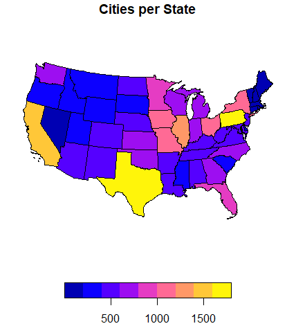
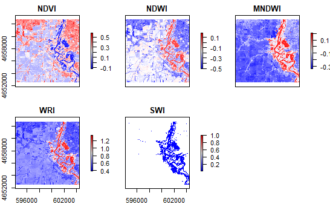
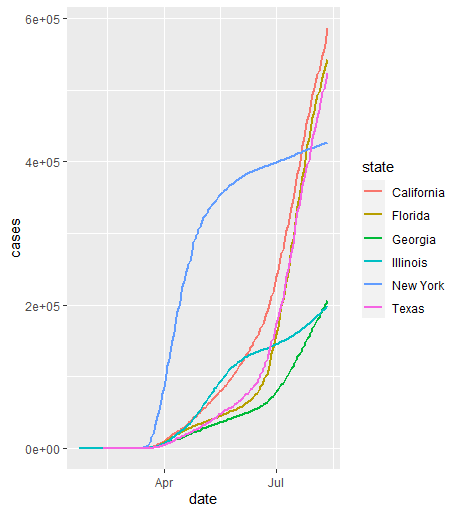

In 2020-2021, I completed a GIS series using R language and ArcGIS software. I drafted code, completed data science projects, and improved my geospatial data skills. This is a collection of my work.

### **2021**

#### **Comparitive Analysis of NYC and Detroit Water Quality through Population and Income**

### [Proposal](./176C/176C Final Proposal Slides (3).pdf)

### [Report](./176C/176C Final Report (1).pdf)

### [Poster](./176C/Geog 176C Poster.pdf)

********

### **2020**

## [Building a project website (R)](https://github.com/Hindstein/GISPort/blob/master/index.html)
 
 - This assignment focused on building a static user site with Github Pages
 - Includes a github repository for access to all the code involved
 - The quality of work is a big step-up from my previous experience
 - Completed using *RStudio* and *R* language
 - Familiarizes *RStudio* and *Github* transparency
 
 
## [COVID-19 Pandemic (R)](https://hindstein.github.io/geog-176A-labs/lab-02-ianhinds.html)
 
 - This lab breaks down NY Times data on the COVID-19 Pandemic
 - It includes the use of ggplot, and data manipulation to visualize the effects of COVID on different populations
 - The results expose natural spread, and the effects of preventative methods (mask, Social Distancing, etc.)
 - Performing a partial COVID analysis similar to the California Department of Public Health
 

 
 
## [Distances and Projections (R)](https://hindstein.github.io/geog-176A-labs/lab-03-ianhinds.html)
 
 - This journal uses *simple features*, *USAboundaries*, *rnaturalearthdata* to measure border distances and project border zones
 - Data Wrangling
 - Identifying distances
 - Applying boundary lines and data to study regions
 - Quantifying border zones
 - Mapping border zones
 - Analyzing the impacted populations at the border zone, numbers that drive policy and current events

 
 
## [Tesselations, Spatial Joins, Point-in-Polygon (R)](https://hindstein.github.io/geog-176A-labs/lab-04-ianhinds.html)
 
 - This lab uses *simple features*, *USABoundaries::us_counties*, and *rmaphshaper* to create Tessellations of the continental US
 - Covers Spatial Tile shaping and sizing
 - Simplifying geometric point values
 - Creating Funcitons to return data.frames, area, plots, and other operations
 - Analyzes the risk level, age, and purpose of the 91,000 dam systems in the US (data sourced from U.S. Army Corps of Engineers)
 - Completing a major, full scale dam analysis similar to ongoing efforts to monitor dam patterns and health in the USA.
 

 
## [Rasters and Remote Sensing (R)](https://hindstein.github.io/geog-176A-labs/lab-05-ianhinds.html)

 - Uses *raster*, *getlandsat*, *osmdata*, and *mapview* libraries
 - Analyzes flood data from Palo, Iowa (26 September 2016)
 - Uses *raster* to stack data files
 - Studies natural features/resources using bandwidth combinations from satellite images
 - Implemented a remote sensing based flood analysis similar to those carried out by the NASA Earth Observatory
 
 

## [Terrain Analysis (R)](https://hindstein.github.io/geog-176A-labs/lab-06-ianhinds.html)
 - Visualizes hydrological data from Mission Creek in Santa Barbara
 - Determines terrain, elevation, flood, railway, and stream variation
 - Attempts to highlight buildings impacted by a 2017 flood of Mission Creek
 - Constructing a complete (or partial) FIM library in the same way NOAA is trying to generalize the USA using the combined National Water Model - HAND method, and companies like Azavia, NSF, and ESRI are trying to operationalize

 

  
 
 ******
 
 
### **Below are several examples of various plots, maps, graphs, etc. All visuals were created in *RStudio*, using *ggplot* and other geospatial libraries.**

## **Continental US States Surrounding Tennesee**

 
 
*****

## **Regional COVID-19 Cases/Deaths**

*****

## **States With Most COVID Cases**

*****