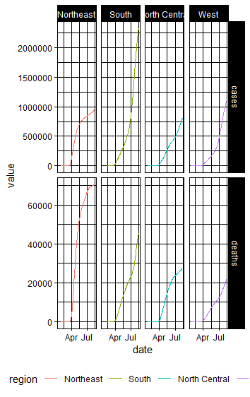
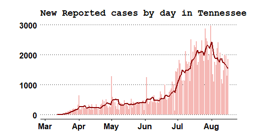

Below are several examples of various plots, maps, graphs, etc. All visuals were created in *RStudio*, using *ggplot* and other geospatial libraries. 

# Regional COVID-19 Cases/Deaths

*****

# States With Most Cases

*****

# Tennessee COVID Case History

*****

# Continental US States Surrounding Tennesee

*****