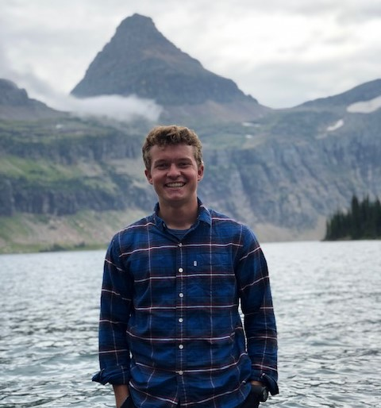

```{r, echo = FALSE}
library(icon)
```

<center>
# Hi, I'm Ian Hinds.
<center>



**Project Description** This site serves as a portfolio for all GIS work completed within an Introductory GIS course at the University of California, Santa Barbara. The course used only *R* as the primary coding language, along with *RStudio* for coding work. This course is/was a big step into the world of practical geographical applications and an exciting experience.


**Personal:** I'm originally from Palmdale California, but since the pandemic, I have been between Virginia and Tennessee. I enjoy being outside, especially now, doing anything. I have a big interest in aviation and flying, as well as diving through water and the air. I'm in Army ROTC, pursuing a military career as an Aviator or Combat Engineer, but GIS skills will follow me wherever I go.

*****


